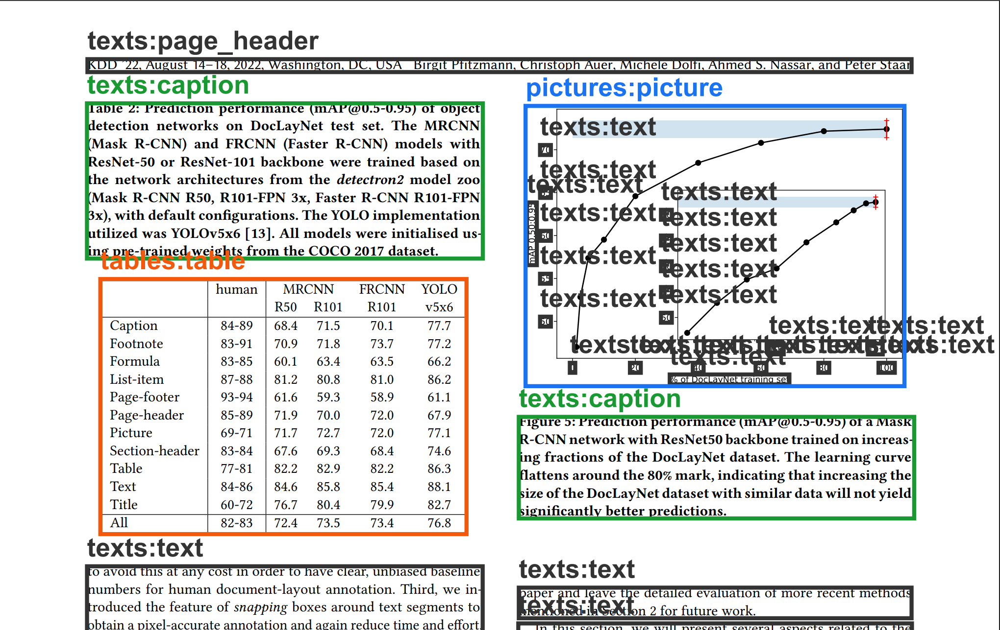
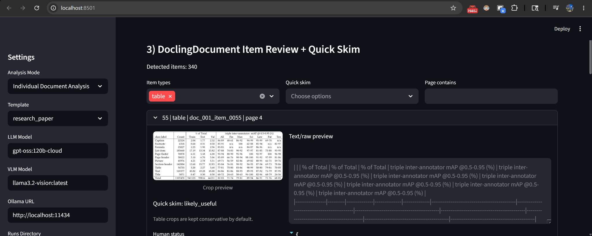
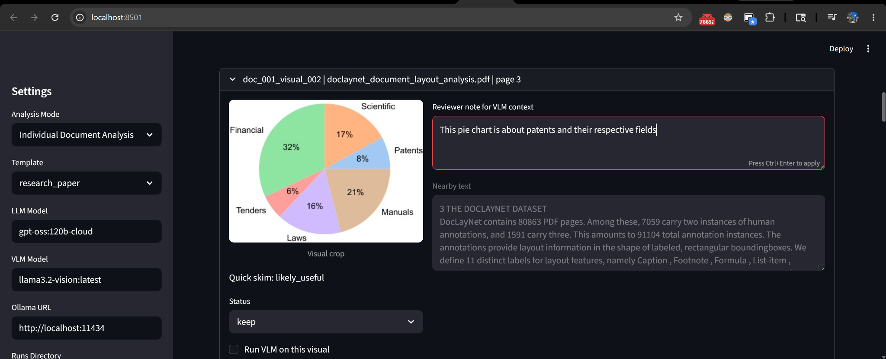
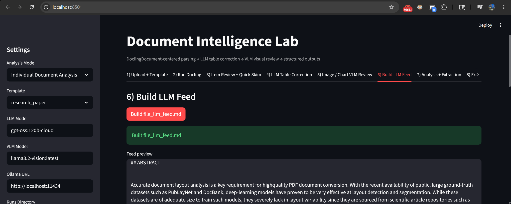
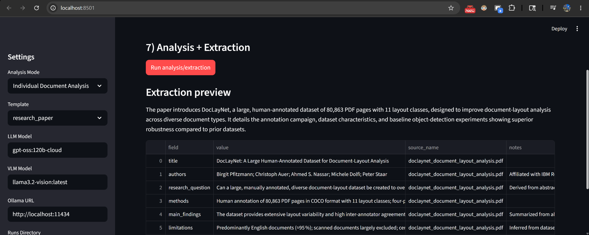
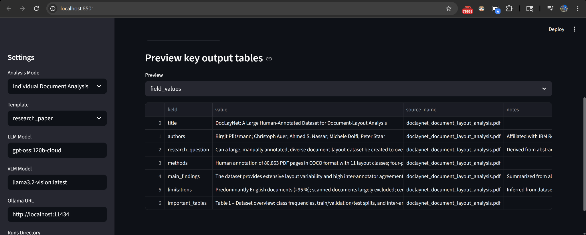

# Document Intelligence Lab

Document Intelligence Lab is a local-first document processing application that parses PDFs with Docling, reviews detected document structure, corrects extracted tables with an LLM, analyzes selected visuals with a VLM, and exports structured results to JSON, Markdown, and Excel.

The project is centered around Docling's structured document output. Instead of treating a PDF as one block of text, the app works with ordered document items such as text blocks, section headers, tables, pictures, captions, and page elements.

```text
PDF documents
→ Docling parsing
→ DoclingDocument item map
→ item review + quick skim
→ LLM table correction
→ image/chart VLM review
→ LLM-ready Markdown feed
→ structured extraction
→ JSON / Markdown / Excel outputs
```

## Features

- PDF parsing with Docling.
- DoclingDocument item review with page, type, crop, and raw text previews.
- Outlined PDF generation for visual layout inspection.
- Quick skim labels for detected visual crops.
- LLM-based cleanup for Docling-extracted tables.
- Reviewer notes for image/chart VLM context.
- LLM-ready Markdown feed generation.
- Template-based structured extraction.
- Individual document analysis and consolidated dossier analysis.
- Excel export with preview tables before download.

## Demo

### Layout Inspection

The app generates an outlined PDF that overlays detected document regions on top of the original page. This makes it easier to inspect what Docling detected as text, tables, captions, pictures, and other layout items.



[Open sample outlined PDF](demo_outputs/doclaynet_sample_run/doclaynet_document_layout_analysis_outlined.pdf)

### DoclingDocument Item Review

Detected items are shown in reading order with item type, page number, crop preview, raw extracted content, quick skim label, and review status.



### Visual Review with Reviewer Notes

Visual items can be reviewed before VLM analysis. Reviewer notes provide extra context for image/chart interpretation.



### LLM Feed Builder

The app rebuilds a clean Markdown feed from reviewed document items, corrected tables, and visual summaries.



### Structured Extraction

The selected template produces structured field outputs with source names and notes.



### Excel Preview

Generated outputs can be previewed as tables before downloading the Excel workbook.



[Download sample Excel export](demo_outputs/doclaynet_sample_run/document_intelligence_export.xlsx)

## How the Pipeline Works

### 1. Upload and Template Selection

The user uploads one or more PDFs and selects an extraction template.

Templates define the fields that should be extracted during the analysis stage.

Example templates:

```text
generic_document
research_paper
grant_program
event_flyer
company_overview_public
```

### 2. Docling Parsing

Docling parses each PDF and generates the base document outputs.

Typical outputs:

```text
raw_docling.md
raw_docling.json
outlined_file.pdf
layout_items.json
raw_tables.json
visual_items.json
crop previews
```

The main output used by the rest of the app is `layout_items.json`, which stores the ordered document item map.

### 3. Item Review and Quick Skim

The app displays detected document items in reading order.

Each item can include:

- source file name
- page number
- item type
- raw extracted text
- crop preview
- bounding box metadata
- quick skim label
- review status
- optional reviewer note

Quick skim helps identify visual crops that are likely useful, empty, decorative, or needing review.

### 4. LLM Table Correction

Docling detects and extracts tables first. Selected table outputs are then sent to a text LLM for cleanup.

The correction step focuses on:

- preserving original values
- improving row and column structure
- cleaning wrapped text
- repairing obvious formatting issues
- returning structured rows and columns

Corrected tables are saved to:

```text
cleaned_tables.json
```

### 5. Image and Chart VLM Review

Visual items are reviewed separately from text and tables.

The reviewer can add a short note before VLM analysis.

Example:

```text
Focus on the labels, percentages, and overall trend shown in the chart.
```

The VLM receives the crop, nearby text, source metadata, and reviewer note. Results are saved to:

```text
image_summaries.json
```

### 6. LLM Feed Generation

The app builds a clean Markdown feed by replaying the document item order.

```text
text items → copied into the feed
section headers → Markdown headings
list items → Markdown list entries
tables → cleaned table output
visuals → VLM summary output
```

Output:

```text
file_llm_feed.md
```

### 7. Structured Extraction and Export

The selected template is applied to the cleaned feed.

Common outputs:

```text
structured_extraction.json
final_report.md
consolidated_dossier.json
consolidated_dossier.md
document_intelligence_export.xlsx
```

## Installation

### Clone the repository

```bash
git clone https://github.com/YOUR-USERNAME/document-intelligence-lab.git
cd document-intelligence-lab
```

### Create an environment

Using conda:

```bash
conda create -n docintellab python=3.11
conda activate docintellab
```

Using venv:

```bash
python -m venv .venv
.venv\Scripts\activate
```

### Install dependencies

```bash
pip install -r requirements.txt
```

### Configure settings

Copy the example environment file:

```bash
copy .env.example .env
```

Example settings:

```text
OLLAMA_BASE_URL=http://localhost:11434
DEFAULT_LLM_MODEL=qwen3:14b
DEFAULT_VLM_MODEL=llama3.2-vision:latest
RUNS_DIR=runs
```

### Start Ollama

```bash
ollama serve
```

Check installed models:

```bash
ollama list
```

### Run the app

```bash
streamlit run app/streamlit_app.py
```

On Windows, you can also use:

```bash
run_app.bat
```

## Project Structure

```text
document-intelligence-lab/
│
├── app/
│   └── streamlit_app.py
│
├── src/
│   └── docintellab/
│       ├── docling_pipeline.py
│       ├── table_corrector.py
│       ├── visual_review.py
│       ├── llm_feed_builder.py
│       ├── analysis_runner.py
│       ├── excel_exporter.py
│       ├── ollama_client.py
│       ├── templates.py
│       └── utils.py
│
├── templates/
│   ├── generic_document.json
│   ├── research_paper.json
│   ├── grant_program.json
│   ├── event_flyer.json
│   └── company_overview_public.json
│
├── docs/
│   ├── architecture.md
│   ├── pipeline.md
│   ├── outputs.md
│   └── images/
│
├── demo_outputs/
│   └── doclaynet_sample_run/
│
├── runs/
│   └── .gitkeep
│
├── .env.example
├── .gitignore
├── README.md
├── requirements.txt
└── run_app.bat
```

## Output Files

A typical run creates a folder like this:

```text
runs/
  run_YYYYMMDD_HHMMSS/
    doc_001/
      source.pdf
      raw_docling.md
      raw_docling.json
      outlined_file.pdf
      layout_items.json
      raw_tables.json
      cleaned_tables.json
      visual_items.json
      image_summaries.json
      file_llm_feed.md
      structured_extraction.json
      final_report.md

    consolidated/
      consolidated_dossier.json
      consolidated_dossier.md
      document_intelligence_export.xlsx
```

## Analysis Modes

### Individual Document Analysis

Each document is analyzed separately.

Use this mode when each PDF should produce its own extraction result and report.

### Consolidated Dossier

Multiple documents are combined into one grouped output.

Use this mode when the documents are related and should produce a single merged report or workbook.


## Limitations

- Output quality depends on the parser, OCR quality, and selected local models.
- Very large PDFs may take longer to process.
- Scanned documents may require stronger OCR support.
- Complex tables may still need human review after LLM correction.
- VLM summaries should be reviewed before being treated as final.
- Embedded PDF preview behavior may vary by browser.

## Future Improvements

- Embedding/vector search over cleaned document feeds.
- Semantic table lines for retrieval.
- VLM fallback for severely broken tables.
- Table validation checks.
- Extraction confidence scoring.
- Richer source citation tracking.
- Manual layout correction tools.
- Batch processing queue.
- Evaluation reports for extraction quality.


